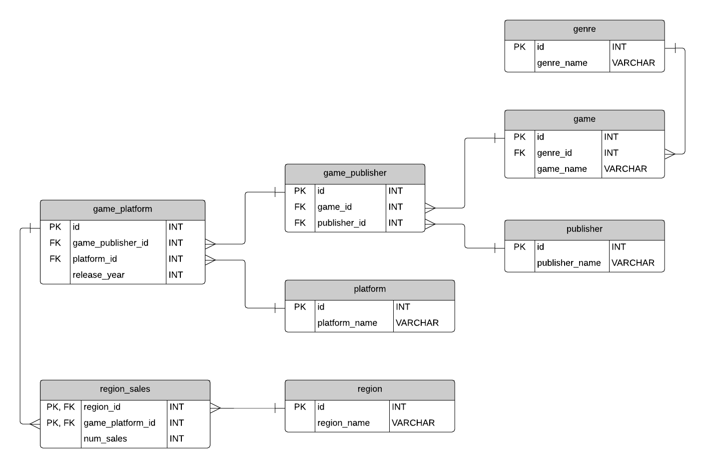

# 🎮 Video Game Sales Analysis (SQL Project)

## 📌 Project Overview
This project analyzes **video game sales data** using **MySQL Workbench**. 
It covers various insights such as **top-selling genres, publisher trends, platform performance, and sales growth over time**. 
The dataset includes information on **games, publishers, platforms, regions, and sales figures**.

## 📌 Entity-Relationship Diagram (ERD)

## 🛠️ Technologies Used
- **MySQL** for database management and queries  
- **MySQL Workbench** for executing queries and visualization  
- **GitHub** for version control

- 
## 📊 Key SQL Queries Solved
### ✅ **1. Top 5 Genres by Global Sales**
- Identifies the highest-selling game genres worldwide.

### ✅ **2. Yearly Sales Trends per Region**
- Analyzes how video game sales have changed over the years in different regions.

### ✅ **3. Publishers with the Most Games in Each Genre**
- Finds which publishers have published the most games in each genre.

### ✅ **4. Platforms with the Highest Sales in North America**
- Determines which gaming platforms have the highest sales in North America.

### ✅ **5. Average Sales per Genre in Japan**
- Computes the average number of sales per genre in the Japanese market.

### ✅ **6. Top Publisher by Sales in Each Region**
- Identifies the leading publisher in each region based on total sales.

### ✅ **7. Year-over-Year Sales Growth by Platform**
- Analyzes how sales have increased or decreased for each platform on a year-over-year basis.

### ✅ **8. Genres with Consistent Sales Growth Over 3 Years**
- Detects which genres have shown steady growth in sales over three years.

